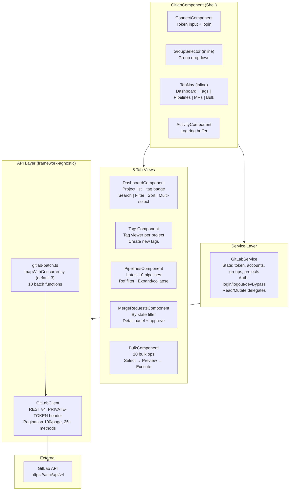
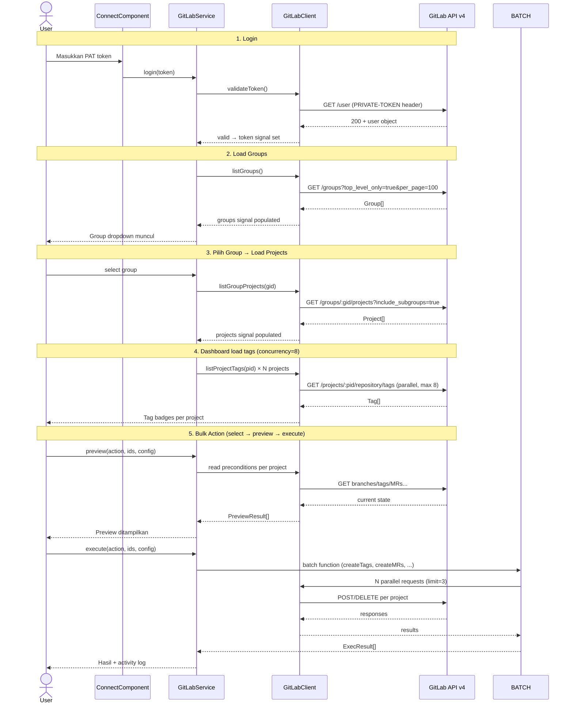
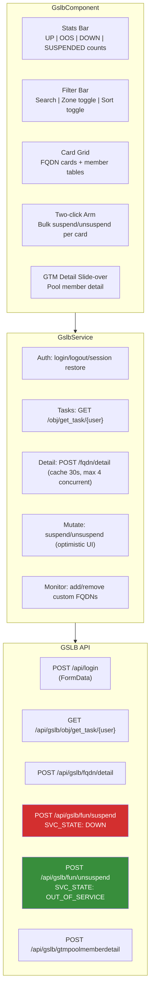
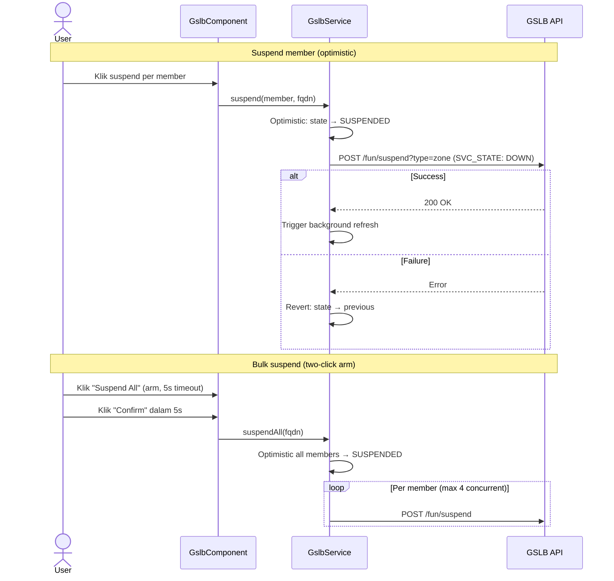
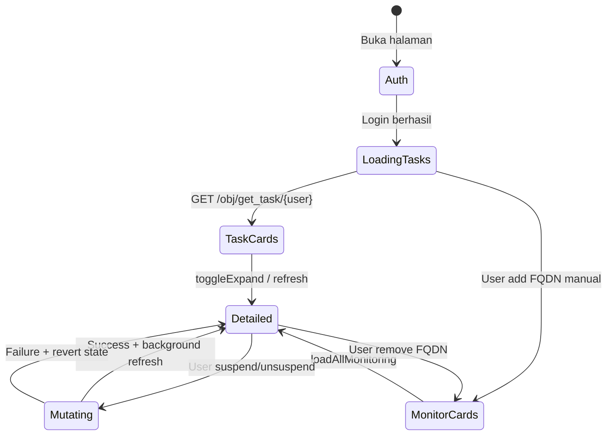
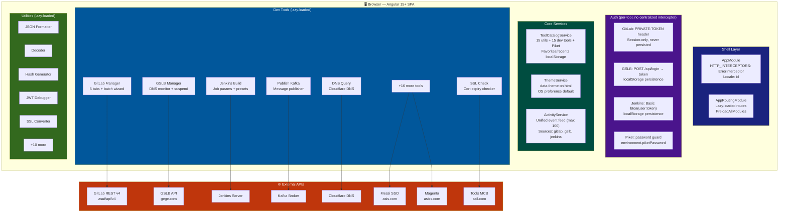
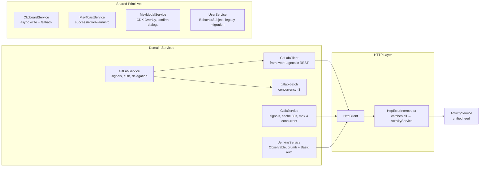

# MSV Tools Dashboard — Architecture

## 1. GitLab Tools (Paling Detail)

### Component Hierarchy



### Data Flow — Login → Dashboard → Bulk



### GitLab API Endpoints

| Method | Endpoint | Digunakan Oleh |
|--------|----------|---------------|
| `GET` | `/user` | validateToken (login) |
| `GET` | `/groups?top_level_only=true&per_page=100` | listGroups |
| `GET` | `/groups/:gid/projects?include_subgroups=true` | listGroupProjects |
| `GET` | `/projects/:pid/repository/branches` | listProjectBranches |
| `GET` | `/projects/:pid/repository/tags?order_by&sort&per_page` | listProjectTags |
| `GET` | `/projects/:pid/members/all` | listProjectMembers |
| `GET` | `/projects/:pid/labels` | listProjectLabels |
| `GET` | `/projects/:pid/milestones?state=active` | listProjectMilestones |
| `GET` | `/projects/:pid/merge_requests?state&per_page` | listProjectMergeRequests |
| `GET` | `/projects/:pid/merge_requests/:iid` | getMergeRequest |
| `GET` | `/projects/:pid/merge_requests/:iid/approvals` | listMergeRequestApprovals |
| `GET` | `/projects/:pid/pipelines?per_page&ref&sort` | listProjectPipelines |
| `POST` | `/projects/:pid/merge_requests/:iid/approve` | approveMergeRequest |
| `DELETE` | `/projects/:pid/merge_requests/:iid/unapprove` | unapproveMergeRequest |
| `POST` | `/projects/:pid/merge_requests` | createMergeRequest (bulk) |
| `POST` | `/projects/:pid/repository/tags` | createTag (bulk) |
| `POST` | `/projects/:pid/repository/branches` | createBranch (bulk) |
| `DELETE` | `/projects/:pid/repository/branches/:name` | deleteBranch (bulk) |
| `POST` | `/projects/:pid/protected_branches` | protectBranch (bulk) |
| `DELETE` | `/projects/:pid/protected_branches/:name` | unprotectBranch (bulk) |
| `POST` | `/projects/:pid/pipeline` | triggerPipeline (bulk) |
| `POST` | `/projects/:pid/releases` | createRelease (bulk) |
| `PUT` | `/projects/:pid/merge_requests/:iid/merge` | mergeMR (bulk) |
| `PUT` | `/projects/:pid/merge_requests/:iid` | closeMR / updateLabels (bulk) |

### File Tree

```
pages/tools-dev/gitlab/
├── gitlab.component.ts              Shell: auth state, 6-view routing, group selector
├── gitlab.component.html            Header + tab nav + conditional views + activity footer
├── gitlab.component.css             Shell styling
├── types.ts                         Shared: ViewName, SortKey, FilterChip, tagAge helpers
├── gitlab-activity.service.ts       Ring buffer (max 200), kind: info|ok|warn|err
├── connect/
│   └── connect.component.ts         Token input, devBypass(), min 10 char validation
├── dashboard/
│   └── dashboard.component.ts       Project list, tag badge, concurrency=8, multi-select
├── tags/
│   └── tags.component.ts            Tag viewer + create, per-project
├── pipelines/
│   └── pipelines.component.ts       Pipeline viewer, ref filter, status colors
├── merge-requests/
│   └── merge-requests.component.ts  MR list, state filter, detail + approve
├── bulk/
│   └── bulk.component.ts            10 actions, 3-step wizard, two-click arm safety
└── activity/
    └── activity.component.ts        Activity log display

shared/service/gitlab/
├── gitlab-api.ts                    GitLabClient (framework-agnostic), all domain types
├── gitlab.service.ts                Angular facade: signals, auth, delegation
└── gitlab-batch.ts                  Pure async batch orchestration (10 operations)
```

---

## 2. GSLB Manager



### Suspend/Resume Flow



### Card Lifecycle



---

## 3. Full Dashboard Architecture



### Service Dependency Graph



### Base URLs (Environment Config)

| Key | Purpose | Tools |
|-----|---------|-------|
| `hostToolsMcb` | File server, data mgmt, keluhan, QRIS, Kafka, batch | Check Data, Delete Data, File Server, Push Notif, Publish Kafka, Keluhan List |
| `hostMessiProd` | Messi SSO / user lookup | Fix Data User, Fix After Merge |
| `hostMagentaProd` | Magenta IndukCicilan / Pemilik | Check Data, Fix Data User |
| `hostBatchRunner` | Batch runner endpoint | Batch Runner |
| `hostGslb` | GSLB login + API | GSLB Manager |

---

## 4. Utility Tools (Pure Client-Side)

Semua 15 utility tools **tidak memanggil API eksternal**. Mereka pure frontend, hanya menggunakan:

- `ClipboardService` — copy-to-clipboard dengan fallback `execCommand`
- `MsvToastService` — notifikasi sukses/gagal

| Tool | Dependensi Berat | Notes |
|------|-----------------|-------|
| JSON Formatter | — | |
| Decoder (Base64/URL/Hex) | — | |
| Regex Tester | — | |
| Hash Generator (MD5/SHA) | `crypto-js` | |
| Text Diff | — | |
| Text Transforms | — | |
| Cron Explainer | — | |
| Image ↔ Base64 | — | FileReader API |
| Timestamp Converter | — | |
| Text Sort/Dedupe | — | |
| Character Counter | — | |
| chmod Calculator | — | |
| Random Picker | — | |
| JWT Debugger | — | Base64 decode JWT segments |
| SSL Converter | `node-forge`, `jsrsasign` | Parsing + convert cert/key/PFX |

---

## 5. New Tools (Recently Added)

| Tool | Path | Function |
|------|------|----------|
| SSL Converter | `/tools-dev/ssl-converter` | Upload/paste cert → detect type → convert format (PEM/DER/PKCS/JWK) + metadata |
| Env Var Converter | `/tools-dev/env-var-converter` | Convert .env ↔ JSON/YAML/docker-compose |
| cURL Converter | `/tools-dev/curl-converter` | Parse cURL command → code snippet (Python/JS/Go/etc) |
| Postman Viewer | `/tools-dev/postman-viewer` | View/explore Postman collection JSON |

---

## 6. Testing Strategy

| Scope | Command |
|-------|---------|
| Full suite | `npx ng test --watch=false --browsers=ChromeHeadless` |
| Single tool | `npx ng test --watch=false --browsers=ChromeHeadless --include="**/component-name.component.spec.ts"` |
| Logic only | `npx ng test --watch=false --browsers=ChromeHeadless --include="**/*.logic.spec.ts"` |

**Catatan:** Untuk test isolated tools dengan `--include`, pastikan spec tidak meng-import component yang punya `templateUrl`/`styleUrl` — webpack entry minimal tidak punya CSS/HTML loader. Solusi: extract pure logic ke `*.logic.ts` (seperti `ssl-converter.logic.ts`).
